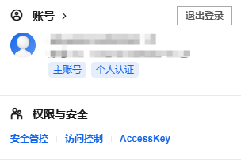
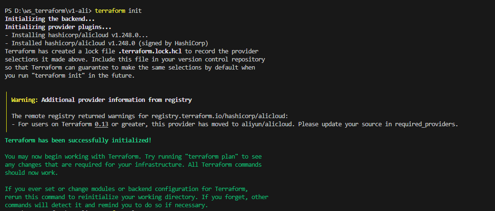
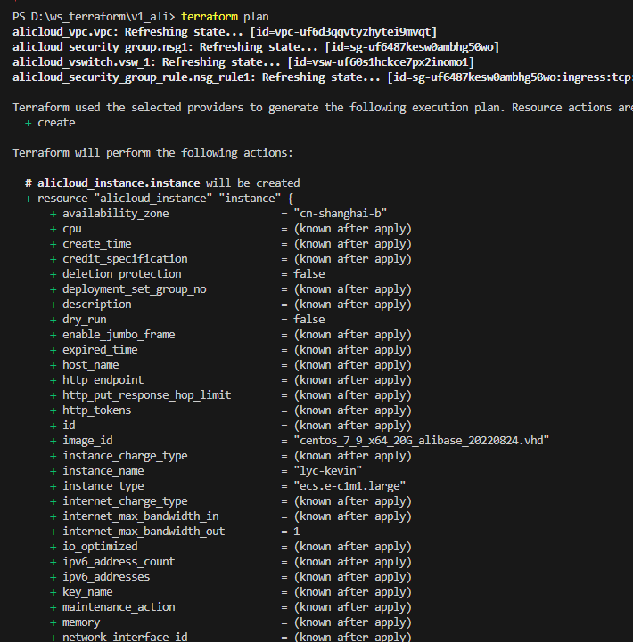
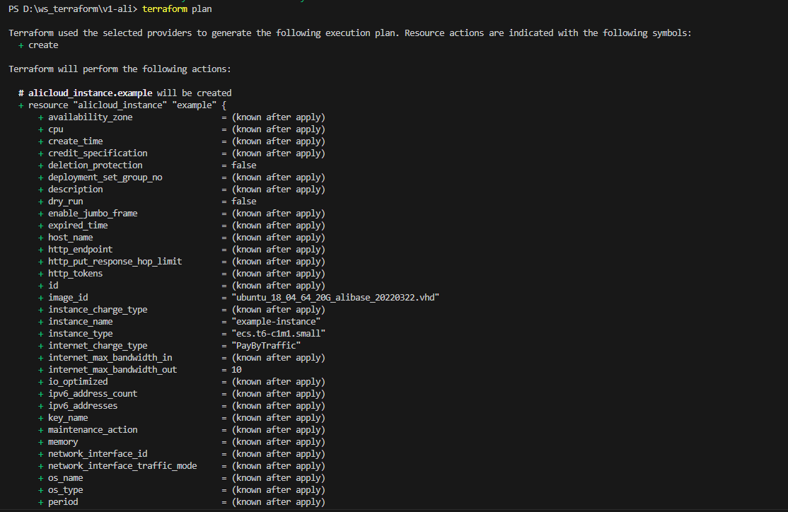
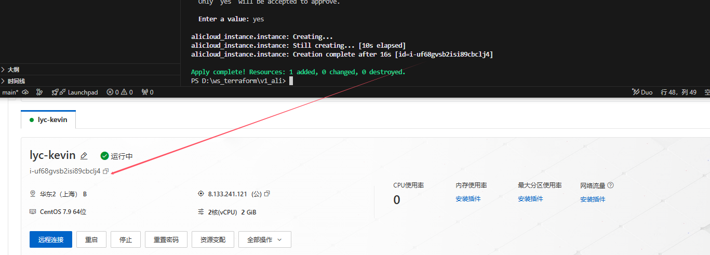
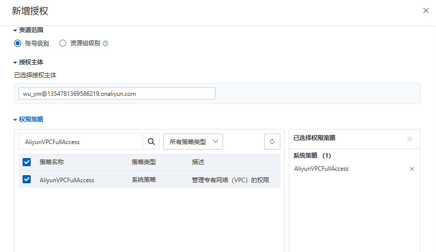

# Aliyun-ECS

这是一个完整实例，用terraform申请阿里云服务器。以及遇到的问题及解决方法。

### 1、安装工具及编辑器

##### 安装 Terraform

如果你还没有安装 Terraform，可以从 [Terraform 官方网站](https://www.terraform.io/downloads.html) 下载对应操作系统的安装包，然后按照官方文档进行安装。

##### 配置阿里云凭证

你需要获取阿里云的 Access Key ID 和 Access Key Secret，这些凭证用于 Terraform 与阿里云进行身份验证。可以在阿里云控制台的 [AccessKey 管理页面](https://usercenter.console.aliyun.com/#/manage/ak) 生成。

****

### 2、编写资源   

```yaml
#定义云厂商
provider "alicloud" {
  region     = "cn-shanghai"
  access_key = ""   #修改成自己的ak
  secret_key = ""   #修改成自己的sk
}


#创建vpc
resource "alicloud_vpc" "vpc" {
  vpc_name   = "vpc_1"
  cidr_block = "10.0.0.0/16"
}

# 创建vswitch
# alicloud_vswitch是阿里云的资源字段，vsw_1字段是tf文件中的自定义唯一资源名称,vswitch_name字段是在阿里云上的自定义备注名
resource "alicloud_vswitch" "vsw_1" {
  vswitch_name = "vsw_aliyun1"
  vpc_id       = alicloud_vpc.vpc.id
  cidr_block   = "10.0.0.0/24"
  zone_id      = "cn-shanghai-b"
}

#新建安全组
resource "alicloud_security_group" "nsg1" {
  security_group_name   = "lyc_aliyun_nsg1"
  vpc_id = alicloud_vpc.vpc.id
}

#将nsg_rule1、nsg_rule2加入安全组lyc_aliyun_nsg1中
resource "alicloud_security_group_rule" "nsg_rule1" {
  type              = "ingress"
  ip_protocol       = "tcp"
  nic_type          = "intranet"
  policy            = "accept"
  port_range        = "1/65535"
  priority          = 1
  security_group_id = alicloud_security_group.nsg1.id
  cidr_ip           = "0.0.0.0/0"
}


#创建ECS实例
resource "alicloud_instance" "instance" {
  # cn-shanghai
  availability_zone          = "cn-shanghai-b"
  security_groups            = ["${alicloud_security_group.nsg1.id}"]
  instance_type              = "ecs.e-c1m1.large" #若实例规格下线，请使用目前售卖中的实例规格
  system_disk_category       = "cloud_essd"       #若磁盘规格下线，请使用目前售卖中的实例规格
  image_id                   = "centos_7_9_x64_20G_alibase_20220824.vhd"
  instance_name              = "lyc-kevin"
  vswitch_id                 = alicloud_vswitch.vsw_1.id
  internet_max_bandwidth_out = 1
  password                   = "5jejYWzSjZhWQc7G22"
}
```

```bash
在终端中，进入到包含 `main.tf` 文件的目录，然后运行以下命令来初始化 Terraform 工作目录：
terraform init
```



### 3、查看常用

```bash
# 预览资源变更
运行以下命令来预览 Terraform 计划创建的资源：
terraform plan
这个命令会显示 Terraform 将要执行的操作，但不会实际创建资源。

# 应用资源变更
如果预览结果符合预期，可以运行以下命令来实际创建资源：
terraform apply

Terraform 会再次显示计划创建的资源，并提示你确认操作。输入 yes 并回车，Terraform 就会开始创建资源。
```






在应用后进入ECS控制台可以看到该实例已经被创建：




### 4、解决问题

#### 在应用时出现如下报错：

```
 Error: [ERROR] terraform-provider-alicloud/alicloud/resource_alicloud_vpc.go:255: Resource alicloud_vpc CreateVpc Failed!!! [SDK alibaba-cloud-sdk-go ERROR]:
│ SDKError:
│    StatusCode: 400
│    Code: Forbidden.RAM
│    Message: code: 400, User not authorized to operate on the specified resource, or this API doesn't support RAM. request id: D624D3E8-47D9-5850-BACF-0297493703B1
```

#### 可能的原因

1. **RAM 用户权限不足**：要是你使用的是 RAM（资源访问管理）用户的凭证，这个用户可能没有足够的权限来创建 VPC（虚拟专用网络）资源。
2. **权限策略配置有误**：RAM 用户的权限策略可能配置不正确，没有包含创建 VPC 所需的权限。
3. **API 不支持 RAM**：虽然这种情况比较少见，但有些阿里云 API 可能不支持通过 RAM 用户进行操作。

#### 解决方法 




