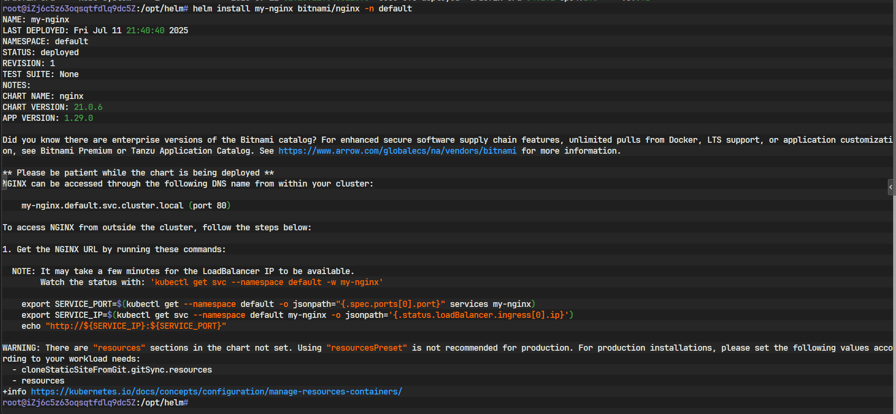

#### 1. 安装 Helm 客户端
```bash
# 下载安装脚本
curl -fsSL -o get_helm.sh https://raw.githubusercontent.com/helm/helm/main/scripts/get-helm-3

# 执行安装
chmod 700 get_helm.sh
./get_helm.sh

# 验证安装
helm version
```

#### 2. 配置 Helm 仓库
```bash
# 添加常用仓库
helm repo add bitnami https://charts.bitnami.com/bitnami
helm repo add prometheus-community https://prometheus-community.github.io/helm-charts
helm repo add jetstack https://charts.jetstack.io  # cert-manager

# 更新仓库索引
helm repo update

# 查看已添加仓库
helm repo list
```


###  二、实践

#### 1. 安装示例应用
```bash
# 安装 Nginx
helm install my-nginx bitnami/nginx -n default

# 查看发布状态
helm list -n default
kubectl get pods,svc -l app.kubernetes.io/instance=my-nginx

# 访问测试
kubectl port-forward svc/my-nginx 8080:80
# 浏览器访问 http://localhost:8080
```

 

#### 2. 升级与回滚

```bash
# 升级应用（修改副本数）
helm upgrade my-nginx bitnami/nginx -n default --set replicaCount=2

# 查看历史版本
helm history my-nginx -n default

# 回滚到前一版本
helm rollback my-nginx 1 -n default
```

#### 3. 卸载应用
```bash
helm uninstall my-nginx -n default
```

---

### 三、高级功能学习
#### 1. 使用自定义 values 文件
创建 `custom-values.yaml`:
```yaml
# 示例：自定义 Redis 配置
auth:
  enabled: false  # 禁用密码

architecture: standalone  # 单节点模式

resources:
  requests:
    memory: 256Mi
    cpu: 100m
```

安装时使用自定义配置：
```bash
helm install my-redis bitnami/redis -f custom-values.yaml -n default
```

#### 2. 调试与模板渲染
```bash
# 查看渲染后的模板（不实际安装）
helm install my-release bitnami/nginx --dry-run --debug

# 查看可用配置参数
helm show values bitnami/nginx
```

#### 3. 创建自己的 Chart
```bash
# 创建新 Chart
helm create my-first-chart

# 目录结构说明
my-first-chart/
├── charts/          # 子chart依赖
├── Chart.yaml       # chart元数据
├── templates/       # Kubernetes模板文件
│   ├── deployment.yaml
│   ├── _helpers.tpl
│   ├── hpa.yaml
│   ├── ingress.yaml
│   ├── service.yaml
│   └── ...
└── values.yaml      # 默认配置值
```

---

### 四、结合 Argo CD 实践 GitOps
#### 1. 在 Argo CD 中部署 Helm Chart
在 Argo CD UI 中创建应用：
- **Repository URL**: `https://charts.bitnami.com/bitnami`
- **Chart**: `redis`
- **Target Revision**: `17.x.x` (指定版本)
- **Values**: 粘贴自定义配置或使用 values.yaml 文件路径

#### 2. Helm 与 GitOps 工作流
1. 创建 Git 仓库存储 Helm Chart
2. 修改 values.yaml 或 templates
3. 提交变更到 Git 仓库
4. Argo CD 自动同步变更到集群

```bash
# 示例仓库结构
my-helm-repo/
├── apps/
│   ├── redis/
│   │   ├── Chart.yaml
│   │   ├── values.yaml
│   │   └── templates/
│   └── nginx/
└── argocd-apps.yaml  # Argo CD 应用定义
```

---

### 五、实战练习项目
#### 项目 1：部署 WordPress 完整栈
```bash
# 安装 MySQL
helm install my-db bitnami/mysql -n wordpress \
  --set auth.rootPassword=secret \
  --set primary.resources.requests.memory=256Mi

# 安装 WordPress
helm install my-wp bitnami/wordpress -n wordpress \
  --set mariadb.enabled=false \
  --set externalDatabase.host=my-db-mysql \
  --set resources.requests.memory=256Mi
```

#### 项目 2：创建自定义 Chart
1. 创建 Node.js 应用的 Chart
2. 添加 ConfigMap 和 Secret 支持
3. 实现基于 values 的环境配置切换
4. 添加 Ingress 模板
5. 打包并部署到私有仓库

```bash
# 打包 Chart
helm package my-first-chart

# 创建本地仓库
mkdir helm-repo
mv my-first-chart-0.1.0.tgz helm-repo/
helm repo index helm-repo/

# 通过 Python 临时提供仓库服务
python3 -m http.server 8080 --directory helm-repo
```

---

### 六、学习资源推荐
1. **官方文档**：
   - [Helm 官方文档](https://helm.sh/docs/)
   - [Chart 模板指南](https://helm.sh/docs/chart_template_guide/)

2. **实用命令备忘**：
   ```bash
   # 查看 Chart 信息
   helm show chart bitnami/nginx
   
   # 搜索 Chart
   helm search hub nginx
   
   # 查看已安装版本
   helm list -A
   
   # 添加 OCI 仓库 (Docker Registry)
   helm registry login registry.example.com
   helm repo add myrepo oci://registry.example.com/charts
   ```

3. **调试技巧**：
   ```bash
   # 检查模板语法
   helm lint my-chart
   
   # 查看渲染后的资源
   helm template my-release ./my-chart -n test
   ```

---

### 七、最佳实践与注意事项
1. **资源限制**：
   ```bash
   helm install ... --set resources.requests.memory=256Mi
   ```
   
2. **命名空间管理**：
   ```bash
   # 为每个项目创建独立命名空间
   kubectl create ns project-alpha
   helm install -n project-alpha ...
   ```

3. **安全实践**：
   ```bash
   # 使用 Secrets 管理敏感数据
   helm install ... --set db.password=$DB_PASSWORD
   ```

4. **清理策略**：
   ```bash
   # 定期清理测试发布
   helm uninstall $(helm list -q -n test) -n test
   ```

---


## 遇到的问题

### Helm 无法连接到 Kubernetes API 服务器

错误信息 `Kubernetes cluster unreachable: Get "http://localhost:8080/version"` 表明：

1. Helm 尝试通过 `localhost:8080` 连接 Kubernetes API
2. 但你的 K3s 实际监听在 `6443` 端口（HTTPS）
3. Helm 使用了错误的 kubeconfig 配置


### 解决方法

#### 步骤 1：验证 K3s 运行状态

```
sudo systemctl status k3s
```

确保状态为 `active (running)`

#### 步骤 2：设置正确的 kubeconfig

```
# 1. 将 K3s 的 kubeconfig 复制到用户目录
mkdir -p $HOME/.kube
sudo cp /etc/rancher/k3s/k3s.yaml $HOME/.kube/config
sudo chown $(id -u):$(id -g) $HOME/.kube/config

# 2. 修改 server 地址（关键步骤！）
sed -i "s/127.0.0.1/$(hostname -I | awk '{print $1}')/g" $HOME/.kube/config
sed -i "s/localhost/$(hostname -I | awk '{print $1}')/g" $HOME/.kube/config

# 3. 设置环境变量
export KUBECONFIG=$HOME/.kube/config
```

#### 步骤 3：验证 kubectl 连接

```
kubectl cluster-info
```

应该显示类似：

```
Kubernetes control plane is running at https://<你的IP>:6443
CoreDNS is running at https://<你的IP>:6443/api/v1/namespaces/kube-system/services/kube-dns:dns/proxy
```

#### 步骤 4：测试 Helm 连接

```
helm ls --all-namespaces
```

应该显示空列表（无错误）

#### 步骤 5：再次尝试安装

```
helm install my-nginx bitnami/nginx -n default
```


### 端口访问

当更换到新端口（如 8081）后仍无法访问，需要系统性地排查问题。以下是完整的排查流程和解决方案：

1. **优先使用 `curl` 测试** - 绕过浏览器干扰
2. **检查三要素**：
   - 端口转发进程运行中
   - 本地端口监听正常
   - 防火墙双端放行（服务器安全组+本地防火墙）
3. 若仍失败，改用 **NodePort 方式** 直接暴露服务