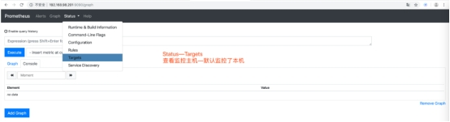

# 部署prometheus

官方网站

https://prometheus.io/download/

prometheus 主程序包

wget https://github.com/prometheus/prometheus/releases/download/v2.11.1/prometheus-2.16.0.linux-amd64.tar.gz

远端主机监控插件(类似于zabbix-agent)

wget  https://github.com/prometheus/node_exporter/releases/download/v0.18.1/node_exporter-1.0.0-rc.0linux-amd64.tar.gz

mysql业务监控插件

wget  https://github.com/prometheus/mysqld_exporter/releases/download/v0.12.0/mysqld_exporter-0.12.1.linux-amd64.tar.gz


### 软件安装与启动

[root@node1 ~]# tar xf prometheus-2.11.1.linux-amd64.tar.gz -C /usr/local/

[root@node1 ~]# cd /usr/local/prometheus-2.11.1.linux-amd64/

[root@node1 prometheus-2.11.1.linux-amd64]# ./prometheus --config.file=prometheus.yml &


### 启动测试


 

看到这个页面说明prometheus启动成功了，默认监控了自己，我们来看一下本机的监控状态。

  		 

​	


点击 status—targets即可看到监控的机器或者资源。

 


看到本机了，同时也可以根据提示在浏览器中输入http://IP或者域名:9090/metrics查看监控数据。

显示监控数据 ： http://192.168.98.201:9090/metrics

 


# 监控业务机器

### 1.安装监控客户端

```sh
[root@node2 ~]# tar -xf node_exporter-0.18.1.linux-amd64.tar.gz -C /usr/local/
[root@node2 ~]# cd /usr/local/node_exporter-0.18.1.linux-amd64/
[root@node2 node_exporter-0.18.1.linux-amd64]# ls
LICENSE  node_exporter  NOTICE
```


### 后台启动

[root@node2 node_exporter-0.18.1.linux-amd64]# nohup /usr/local/node_exporter-1.8.1.linux-amd64/node_exporter &

[1] 7281

[root@node2 node_exporter-0.18.1.linux-amd64]# nohup: 忽略输入并把输出追加到"nohup.out"

\#更新 阿里云 yum

\#安装 yum -y install lsof 

\#业务机器监控插件服务端口

[root@node2 node_exporter-0.18.1.linux-amd64]# lsof -i :9100

COMMAND   PID USER  FD  TYPE DEVICE SIZE/OFF NODE NAME

node_expo 7281 root   3u  IPv6  42486    0t0  TCP *:jetdirect (LISTEN)

 

\#验证  http://被监控机名称:9100/metrics

http://192.168.98.202:9100/metrics

现在我们这台机器上的数据被打包成了一个可以访问的页面，所以我们可以使用浏览器去访问这个页面，看下能否获取到相关的数据，如果能够获取的话就表示没有问题了。 


### 在master添加监控信息

被监控主机设置完成之后，需要在prometeus主配置文件中添加被监控机信息

[root@node1 prometheus-2.11.1.linux-amd64]# tail -4  prometheus.yml 

 \- job_name: 'node2'	#定义名称

  static_configs:#定义具体配置

  \- targets: ['192.168.98.202:9100']#定义目标

\####注意缩进  两个空格

\#重启服务   

```shell
[root@node1 prometheus-2.11.1.linux-amd64]# pkill prometheus
[root@node1 prometheus-2.11.1.linux-amd64]# ./prometheus --config.file=prometheus.yml &
```


注意：prometheus启动报错

**lock DB directory: resource temporarily unavailable"** 

原因:prometheus没有正常关闭，锁文件存在

rm $prometheus_dir/data/lock


### 测试验证

设置完毕看看prometheus页面

 


# Grafana数据展示

### grafana安装

官方网站: grafana:https://grafana.com/

软件包安装

[root@manage01 ~]# dnf -y localinstall grafana-6.6.1-1.x86_64...

yum install -y https://dl.grafana.com/enterprise/release/grafana-enterprise-11.1.0-1.x86_64.rpm


服务启动

[root@manage01 ~]# systemctl enable grafana-server

Created symlink from /etc/systemd/system/multi-user.target.wants/grafana-server.service to /usr/lib/systemd/system/grafana-server.service.

[root@manage01 ~]# systemctl start grafana-server

 

验证启动

[root@manage01 ~]# lsof -i :3000              #检查３００0端口

COMMAND   PID   USER  FD  TYPE DEVICE SIZE/OFF NODE NAME

grafana-s 17154 grafana   8u  IPv6  53939    0t0  TCP *:hbci (LISTEN)

grafana启动成功后，可以通过页面访问到grafana页面


### 添加prometheus数据源


### 其他配置


### 仪表盘管理　


# 警告配置