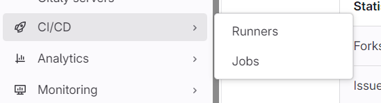
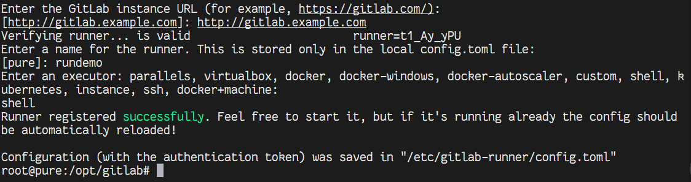
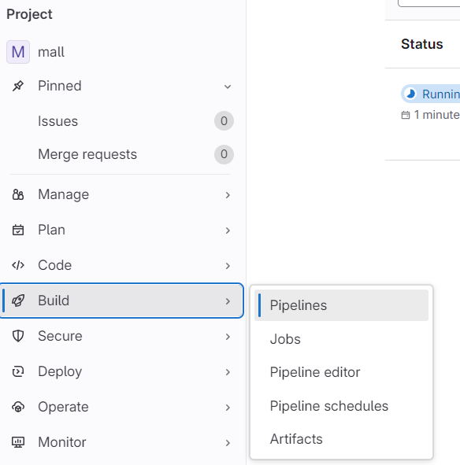
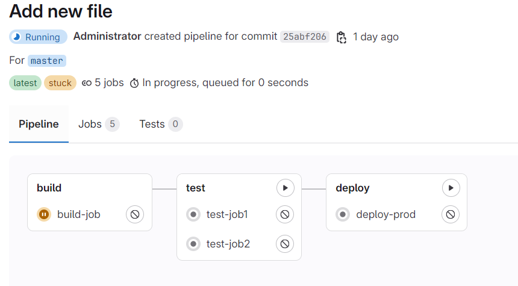
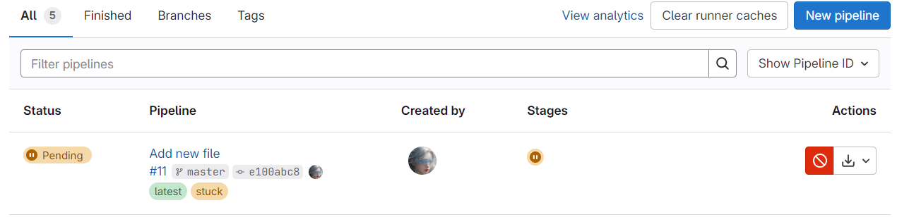
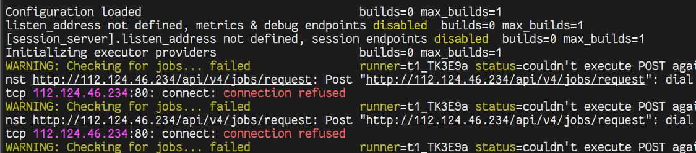

# Gitlab runner

### GitLab CI/CD 工作流

GitLab CI/CD 适合通用的开发工作流程。

可以首先进行代码实现，然后在本地处理更改。然后，可以将提交推送到托管在极狐GitLab 中的远端仓库中的功能分支。

##### 运行自动化脚本（顺序或并行）：

构建和测试您的应用程序。
在 Review App 中预览更改，就像您在 localhost 上看到的一样。

##### 实施后按预期工作：

审核并批准您的代码。
将功能分支合并到默认分支中。
GitLab CI/CD 将您的更改自动部署到生产环境。


此工作流显示了极狐GitLab 流程中的主要步骤。 您不需要任何外部工具来交付您的软件，并且您可以在 GitLab UI 中可视化所有步骤。


### runner

在极狐GitLab 中，runners 是运行 CI/CD 作业的代理。

要查看可用的 runner：
转到 设置 > CI/CD 并展开 Runners。
只要您至少有一个有效的 runner，旁边有一个绿色圆圈，您就有一个 runner 可以处理您的作业。





在页面里配置runner，会提供命令注册runner

```bash
sudo gitlab-runner register --url $URL --registration-token $REGISTRATION_TOKEN
```




当注册 Runner 时，可以向其添加**标签**。

当运行 CI/CD 作业时，通过分配的标签确定要使用的 Runner。 标签是为作业过滤可用 Runner 列表的唯一方式。

例如，如果一个 Runner 有 `ruby` 标签，您可以将此代码添加到您项目中的 `.gitlab-ci.yml` 文件：

```
job:
  tags:
    - ruby
```

当运行作业时，使用带有 `ruby` 标签的 Runner。

可以使用 Prometheus监控 Runner。 您可以查看例如正在运行的作业数量，和正在使用的 CPU 资源等指标。


### 检查 CI/CD 语法

如果使用[流水线编辑器](https://gitlab.cn/docs/jh/ci/yaml/pipeline_editor/index.html)，它会自动验证配置语法。

如果使用 VS Code，您可以使用 [VS Code 的 GitLab Workflow 扩展](https://gitlab.cn/docs/jh/editor_extensions/visual_studio_code/index.html)来验证 CI/CD 配置。


### 查看流水线

在项目的构建中可以看到流水线相关内容。



进入到流水线里可以查看细节。







### 其他问题



- 确保 Runner 配置文件中 GitLab 的 URL 正确。

- 打开 Runner 的配置文件（`/home/pure/.gitlab-runner/config.toml`），检查 `url` 配置项：

  ```
[[runners]]
    url = "http://112.124.46.234"
  ```


